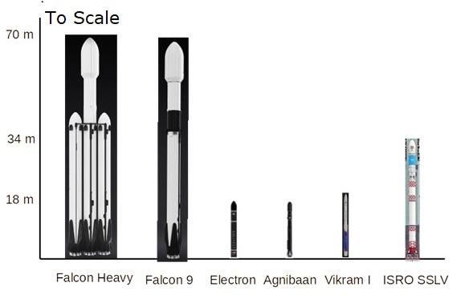

# The rise of the Small Rocket

### Samten J. Nagarajan
August 19, 2022

***Click on a topic to jump to that topic***

**[The Age of large rockets](#the-age-of-large-rockets)**

**[The advent of the small rockets](#the-advent-of-the-small-rockets)**

**[India joins the race](#india-joins-the-race)**

### The Age of large rockets

Since the launch of the first satellite by Russia on 4 October 1957, the Sputnik, thousands of satellites, large and small, have been launched. As of February 8, 2022, according to [Earthsky.org](https://Earthsky.org)[1] there are around 4,550 satellites orbiting the earth—3,790 in Low Earth Orbit (LEO), 139 in Medium Earth Orbit, and the others at higher orbits. Till recently the rockets and correspondingly the payloads they launched were huge; among the payloads were the Apollo Moon Landers, the International Space Station, the Hubble and Webb telescopes, the Mars Lander and so on. A partial list of currently active large rockets includes[2]:

|Name|Country|Payload to LEO (kg)|Payload to MEO (kg)|Cost per launch (US$ millions)|Successful launches to date|Since|
|:-|:-|-:|-:|-:|-:|-|
|Ariane&nbsp;5|European Space Agency|21,000|10,735|165 - 220|108|1996|
|Atlas 5|USA|18,850|8,900|109 - 153|95|2002|
|GSLV III|India|10,000|4,000||3|2014|
|PSLV|India|3,800|1,200||352|1993|
|Proton|Russia|23,000|6,920|65|378|1965|

The currently active large rockets also include the commercial launchers build by the Space X (USA) company.

|Name|Country|Payload to LEO (kg)|Payload to MEO (kg)|Cost per launch (US$ millions)|Successful launches to date|Since|
|:-|:-|-:|-:|-:|-:|-|
|Falcon 9|Space X, USA|22,800|8,300|61.2|168|2010|
|Falcon Heavy|Space X, USA|63,800|26,700|90 - 150|3|2018|

### The advent of the small rockets

Meanwhile miniaturization of electronics has led to the development of small satellites used for communication and earth observation that are often launched in large numbers referred to as a constellation. Obviously, the cost of launching small satellites on a large rocket is prohibitively expensive. One solution to the problem is to ‘rideshare’ many such small satellites on a large rocket so that they can share the cost of the launch. There are several drawbacks to this approach:

- often the company that made the small satellite may have to wait a long time for a rocket to become full enough to launch, and 
- since the rocket is launching many satellites at one time, the small satellite may not be able to achieve the ideal orbit needed for it to be fully effective.

These problems have led to the development of a burgeoning market for small rockets that can deliver small payloads in a cost-effective manner. 

Small satellites weigh less than 500 kg with most in the 10 – 100 kg range. They are used for communication and remote sensing. Many companies including Space X, Amazon, Bharti Airtel, and Tata are planning to launch constellations of satellites to provide cheap internet coverage world- wide. In the US many start-ups have jumped into this new market opportunity. These include:

- Rocket Lab, the market leader with the Electron rocket that has been successfully launched on a regular basis, with plans to launch up to 1 a week. The company also plans to develop a larger rocket, the Neutron, that can carry 13,000 kg to LEO and can be used to launch constellations of small satellites; it will provide direct competition to Falcon 9, the current market leader in that category; it is scheduled for launch in 2024. Like the Falcon 9, the Neutron will be reusable (including the fairing that protects the satellite during the launch, a feat that the Falcon 9 cannot do thus further reducing the cost per lauch.)
- Astra which can launch 200 kg from many locations. Though it successfully launched a satellite in 2021 it has experienced several subsequent failures which makes its future doubtful.
- Launcher 1 by Virgin Orbit which is unique in not having a first stage but instead launching the rocket from a plane after lifting it to an altitude of 34,000 feet. It has had one successful launch in 2021.
- Terran 1 by Relativity Space. Using a massive 3D printer, they plan to 3D print the rocket as well as the engine; the goal is to minimize cost and maximize rapid, reliable production. They plan to make their first launch in 2022.

Many other companies in the US, Spain, Germany, UK, Japan are working on similar ideas. One of the more unusual plans is for a Spanish company to launch the rocket from a balloon!

### India joins the race

India also has joined the race to develop these small rockets especially since commercial ventures in launch systems and satellite development became possible since 2020. The Indian Government set up the Indian National Space Promotion and Authorization Centre (IN-SPACe) under the Ministry of Atomic Energy and Space. This new organization will regulate and support private companies’ entry into the space market. Over 60 start-ups have registered their interest with ISRO.  
  
  **Rocket size comparison**

|Name|Company|Height (m)|Successful launches|Payload to LEO (kg)|
|:-|:-|-:|:-|:-:|
|Electron|Rocket Lab, USA|18|29 (cost per launch is 7.5 million US$)|300|
|Agnibaan|Agnikul Cosmos, India|18|In development|100|
|Vikram|Skyroot Aerospace, India|20|In development|480|
|SSLV|ISRO, India|34|1st launch failed to deploy satellites in proper orbit|500|

### Top 3 Indian companies

The top 3 Indian private space related companies are[3]:

1)	Agnikul Cosmos: founded in 2016, the company was incubated at the IIT, Madras and numbers several Professors from IIT as its consultants. The company plans to develop a highly configurable rocket, the Agnibaan, expected to be operational by 2022. In its various configurations the rocket can carry payloads up to 100 kg to LEO (700 km). The company plans to completely 3-D print its rocket engines.  
(https://www.agnikul.in/)

2)	Skyroot Aerospace: founded in 2018 by former scientists and engineers from ISRO, the company plans to develop the Vikram series of rockets:  
    a.	Vikram I – 480 kg to 500 km LEO,  
    b.	Vikram II – 595 kg to 500 km LEO, and  
    c.	Vikram III – 815 kg to 500 km LEO)  
(https:// https://www.skyroot.in/)

3)	Pixxel.space: founded in 2019, the company plans to launch 18 satellites in 2023 to provide, in the company’s words, “The world’s highest resolution hyperspectral imaging” that will assist many areas—agriculture, urban planning, mining, environmental impact and protection, and the energy industy among many others.  
(https://www.pixxel.space/)

ISRO also plans to join in the act by developing the Small Scale Launch Vehicle (SSLV). This rocket is 34 m tall and uses tried and tested solid-fuel technology and can launch up to 500 kg in LEO. Unfortunately, the August 7, 2022 initial launch failed to insert the 2 satellites in the required orbit; the launch was deemed a partial success because all the previous stages of the rocket performed nominally.

***References:***

[1] earthsky.org/space/who-owns-satellites-company-country, February 8, 2022  
[2] spacedotbiz.substack.com/p/the-launch-landscape-small-rockets, Ian Vorbach, Jun 16, 2021  
[3] equitymaster.com/detail.asp, Top 3 Indian Companies in the Space Race, Jul 19, 2022
